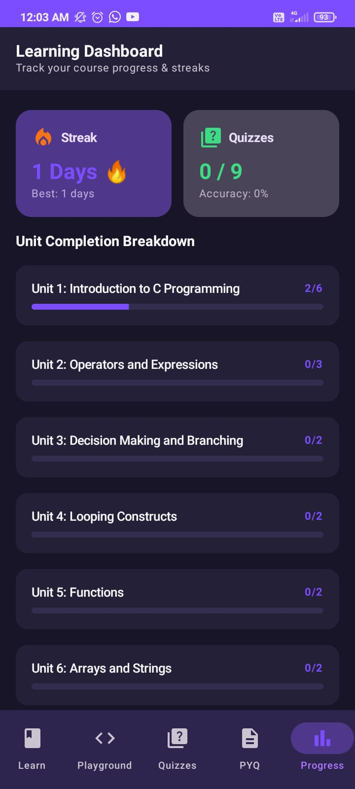
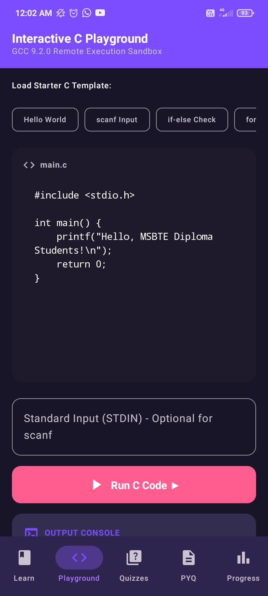
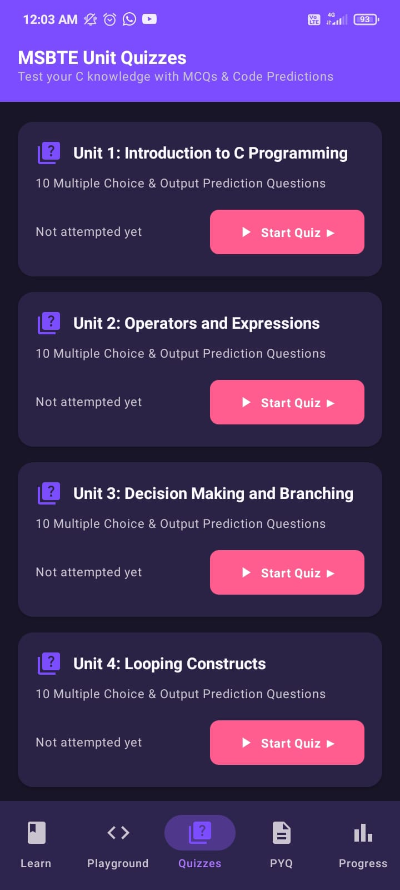
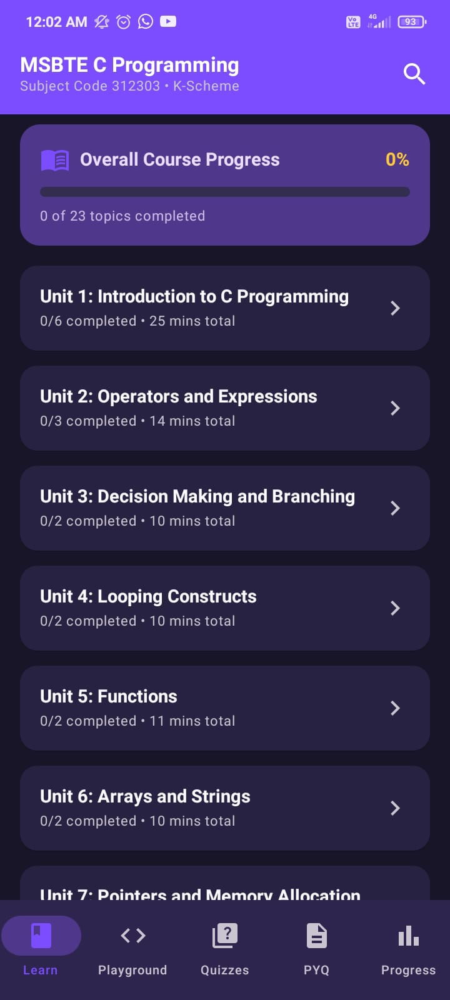

# CLearn - C Programming Learning & Practice App

CLearn is a native Android application built using **Kotlin** and **Jetpack Compose** designed to help students learn C programming, practice live code execution, solve university & technical interview PYQs (Previous Year Questions), and test their knowledge through quizzes.

---

## 📸 Screenshots

<p align="center">
  
  
  
  
</p>

---

## 📱 Features

- **Interactive C Playground:** Write, edit, and run C code directly in the app powered by the Judge0 REST API.
- **Structured Lessons:** Topic-wise learning modules covering fundamental to advanced C programming concepts.
- **PYQ & Interview Prep:** Curated collection of previous year exam questions and technical interview problems.
- **Quizzes & Assessments:** Topic-wise multiple-choice practice quizzes with instant feedback.
- **Progress Tracking & Bookmarks:** Save important lessons and track learning progress offline using local database persistence.

---

## 🛠️ Tech Stack & Architecture

- **Language:** Kotlin
- **UI Framework:** Jetpack Compose (Material 3)
- **Architecture:** MVVM (Model-View-ViewModel) + Repository Pattern
- **Local Persistence:** Room Database
- **Networking:** Retrofit 2 + OkHttp + Gson
- **Remote Code Execution:** Judge0 REST API
- **Concurrency:** Kotlin Coroutines & Flow
- **Navigation:** Jetpack Compose Navigation

---

## 🏗️ Project Structure

```
com.clearn.app
├── data/
│   ├── local/          # Room DB entities, DAOs, Database
│   ├── remote/         # Retrofit API service & Judge0 network models
│   └── repository/     # Repository layer bridging data sources
└── ui/
    ├── components/     # Reusable Compose UI widgets
    ├── navigation/     # App navigation graph & screen routes
    ├── screens/        # Learn, Playground, Quizzes, PYQs & Progress screens
    └── theme/          # Material 3 colors, typography & themes
```

---

## 🚀 Setup & Installation

### Prerequisites
- Android Studio (Hedgehog 2023.1.1 or newer recommended)
- JDK 17
- Android Device / Emulator (API Level 24+ / Android 7.0+)

### Steps
1. Clone the repository:
   ```bash
   git clone https://github.com/itsKomal1508/CLearn-App.git
   ```
2. Open the project in **Android Studio**.
3. Sync project with Gradle files.
4. Select an emulator or connected device and click **Run**.

---

## 📄 License
This project is open-source under the [MIT License](LICENSE).
